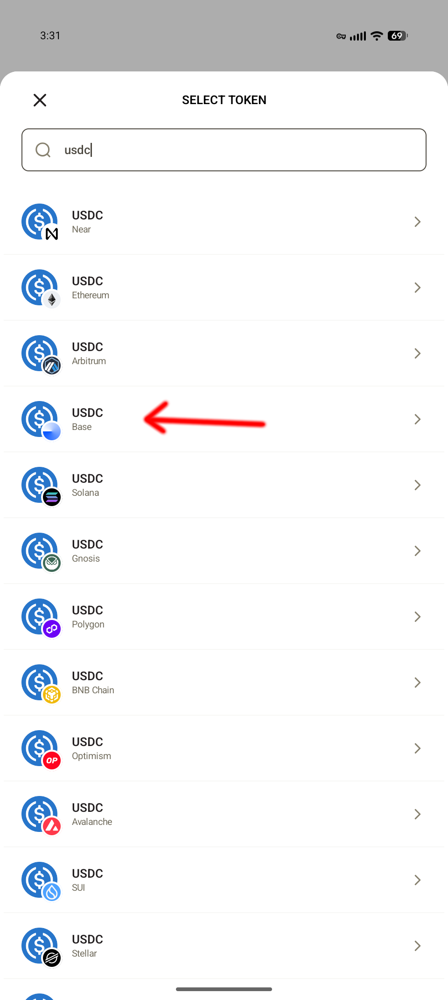
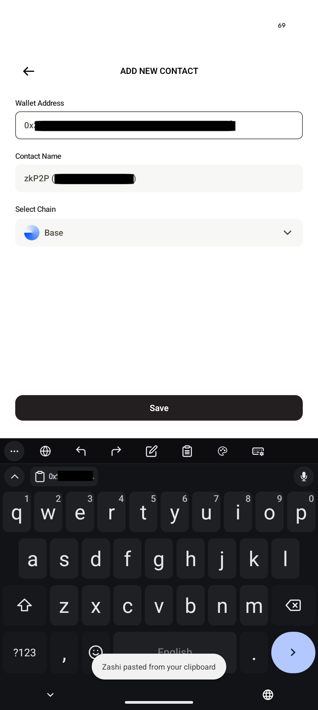
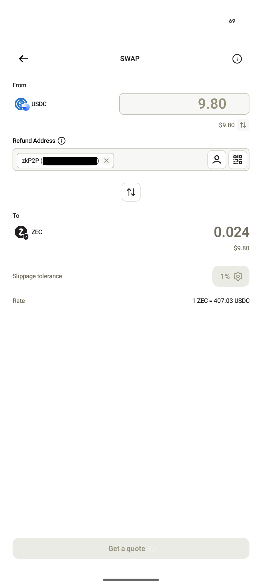
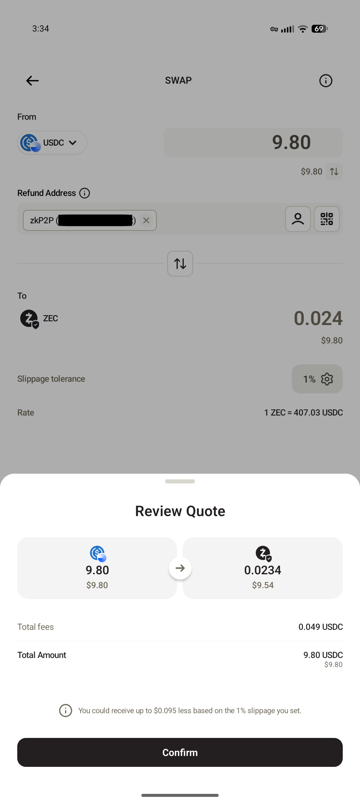
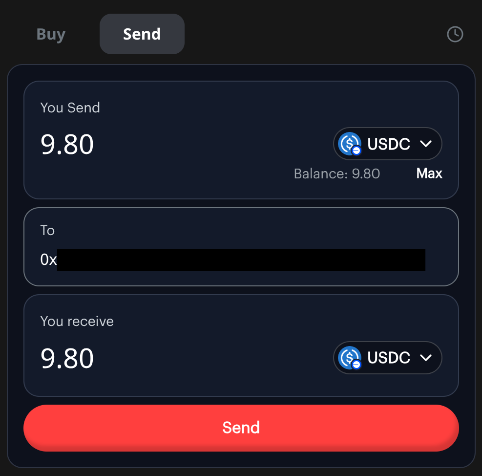
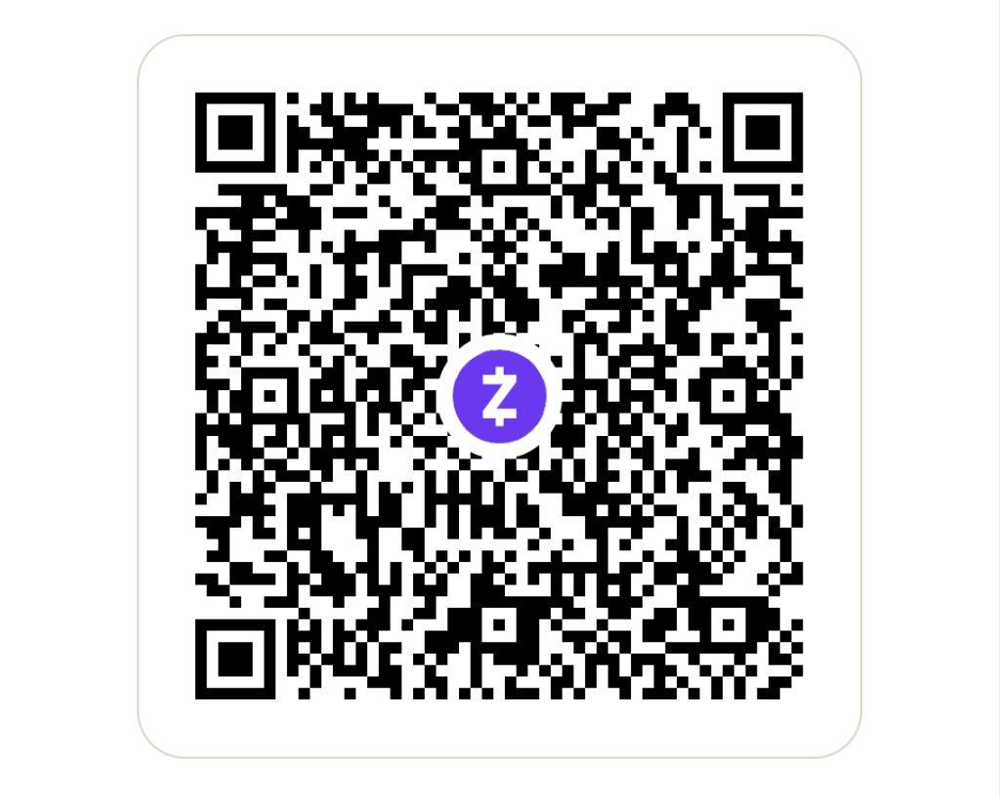

+++
date = '2025-12-14T14:26:50-06:00'
draft = false
title = 'Buy Zcash Privately: A Step-by-Step Guide'
tags = ['cryptocurrency', 'privacy', 'Zcash', 'tutorial']
+++

This guide shows you how to buy Zcash (ZEC) **without going through a
traditional cryptocurrency exchange**.

Most exchanges require you to upload ID and link your identity directly to
every crypto purchase. This method skips that - you'll buy directly from other
people using payment apps you already have.

**Here's what we'll do:**
1. Use a payment app (e.g. Venmo, PayPal, etc) to buy USDC (a digital dollar) from another person
2. Swap that USDC for Zcash directly into your iOS/Android Zcash wallet

That's it. The whole process takes about 15-20 minutes.

<strong>For the technically curious (optional reading)</strong>

You'll use two tools:
- **[Zashi](https://electriccoin.co/zashi)**: A mobile app that stores your
  Zcash and performs swaps
- **[zkP2P](https://zkp2p.xyz)**: A website that connects buyers and sellers
  for peer-to-peer trades

Technical deep-dives:
- [How Zashi uses NEAR-Intents to swap USDC on Base for
  ZEC](https://electriccoin.co/blog/zashi-swaps-decentralized-on-ramp-is-live/)
- [How zkP2P uses zero-knowledge proofs to prove your USD
  payment](https://docs.zkp2p.xyz/protocol/zkp2p-protocol)

## What You'll Need

### 1. Zashi Wallet App

Download Zashi on your phone: https://electriccoin.co/zashi

After installing:
1. Open the app and tap "Create New Wallet"
2. Follow the setup steps

### 2. A Payment App

You'll need one of the supported payment platforms. I use Venmo for this demo,
but zkP2P supports a wide range of payment apps and global currencies.

### 3. Money to Spend

Have ~$10 ready for your first purchase. Small fees will reduce your
final amount slightly.

## Step 1: Buy USDC (Digital Dollars)

I recommend following zkP2P's official guide to buy USDC. Their guide will walk you through how to:

1) create an account on zkP2P

2) find someone selling USDC

3) pay the seller with your payment app

4) receive your USDC in your zkP2P account

**Important:** when you configure your purchase, you'll be asked to pick a
token on a blockchain. Select the **USDC** token on the **Base** blockchain.

**Important:** After you receive your USDC, copy your zkP2P wallet address
(starts with "0x") - you'll need it as a refund address in Step 2. You can find
it in the "Send" tab.

You can find the zkP2P guide
[here](https://docs.zkp2p.xyz/guides/for-buyers/complete-guide-to-onboarding).

## Step 2: Swap USDC for Zcash

Now you'll convert your USDC into Zcash using the Zashi app. The ZEC you
receive will be private - nobody can see your balance or how you spend your
ZEC.

### Start the Swap

1) Open the **Zashi app** on your phone

2) Tap the **"Swap"** button

3) Search for the **USDC** token on **Base**

4) Paste in your zkP2P wallet address you copied (the one starting with "0x")
    - If the swap fails for any reason, your USDC will be returned to that address.
    - Don't worry. You can try again if the swap fails.
    - **Tip:** Save it as a contact in Zashi so you don't need to copy/paste next time

### Get Your Price Quote

5) Enter the amount of USDC you want to swap (should match what you have in
zkP2P, around $9.80 in my case).

6) Tap **"Get a quote"** to see the current exchange rate

7) Review the quote - you'll see how much Zcash you'll receive

8) Tap to confirm to complete start the trade

### Send Your USDC and Complete the Swap

9) Zashi shows you an address where you need to send your USDC - **copy this
address**

10) Switch back to zkP2P website, go to the **"Send"** tab

11) Paste the address from Zashi and send all your USDC to it

12) Wait 1-2 minutes for the transaction to confirm

13) Return to the Zashi app and tap **"I've sent the funds"**

14) Within moments, you'll see a **"Receiving..."** notification in Zashi

15) After a few minutes, the transaction completes and you have Zcash!

## You're Done!

Congratulations! You now own Zcash. Your Zcash will take a few minutes to
become "spendable" (ready to send). Once it's ready, want to test it out?
Use your ZEC to send me your feedback in an encrypted message!

1. In Zashi, tap **"Send"**
2. Scan the QR code below (or paste the address)
3. Leave the amount empty (unless you want to buy me a coffee ☕)
4. Write me a message in the memo field
5. Send!

The message is encrypted - only I can read it. I'd love to hear how this guide
worked for you!

---

*"If we can't crack encryption, then people are walking around with a Swiss
bank account in their pocket."* - **Barack Obama**
